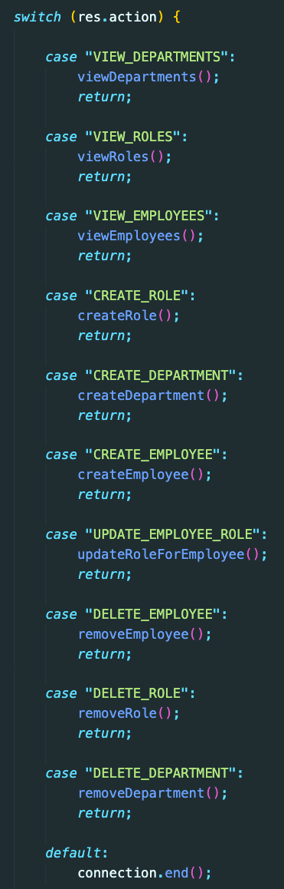
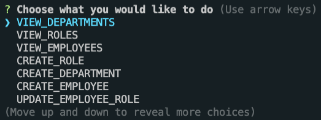
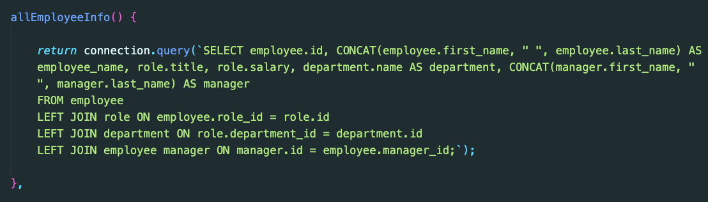
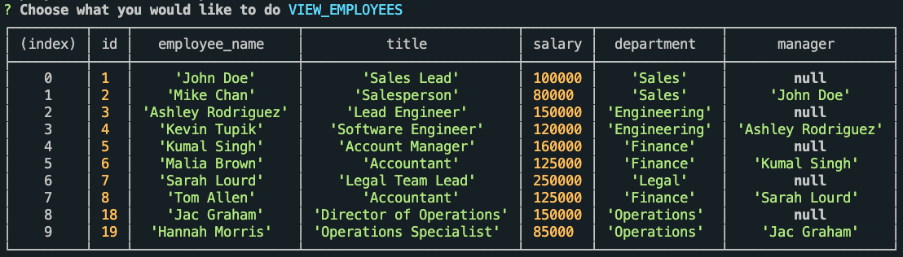

# Employee-Management-System

## Description

The purpose of this project is to create an application that allows the user to manage their employee database through node, inquirere, and MySQL. The user should be able to:

* VIEW:
    * Employees
    * Roles
    * Departments
* CREATE:
    * Employees
    * Roles
    * Departments
* UPDATE the employee's role
* DELETE:
    * Employees
    * Roles
    * Departments

## Table of Contents

* [Links](#links)

* [Usage](#usage)

* [Learning Outcomes](#learning-outcomes)

* [Conclusion](#conclusion)

## Links

* [GitHub Repo](https://github.com/elizabethbrandt/Employee-Management-System)

* [YouTube Demo](https://youtu.be/9IkR809L_E4)

## Usage

* This application is a CLI and the functionality is within the console using node.

Below is a screenshot that displays code to give the user options for the actions they'd like to use in their application

Below is how it's displayed within the console

* This application is able to display tables that shows all the different departments, roles, and employees

Below is a screenshot the code that will create the MySQL `join` table that ties all three tables together

Below is how it's displayed within the console

## Learning Outcomes

#### Modular Code

* This was really great practice at creating code in different places and being able to export and use them elsewhere. I tried to set it up so that I could build it more modular and create a `lib` folder with `view.js`, `create.js`, `update.js`, and `delete.js` files and export them, but was having difficulties. I would try to do this if I had more time. But was happy that my code was working and was hesitant to mess with it.

#### MySQL, JOIN tables, and Foreign Keys

* MySQL was honestly not that bad once you understand the syntax. The most complicated part of this was getting the JOIN tables to link and display as they should. Learning about and using foreign keys, I believe, made the linking of the tables make more sense. This created a line that I coud better visualize.

## Conclusion

In conclusion, I learned a lot with this activity! And I truly enjoyed learning how to make all the connections, both within the tables and between all of the different files. As I mentioned, I would have loved to have figured out how to work the modular code a bit better, but I'll try and get that done later on.